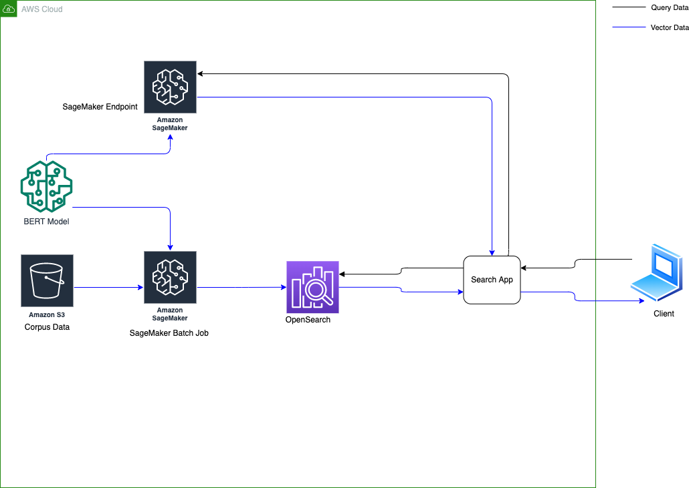
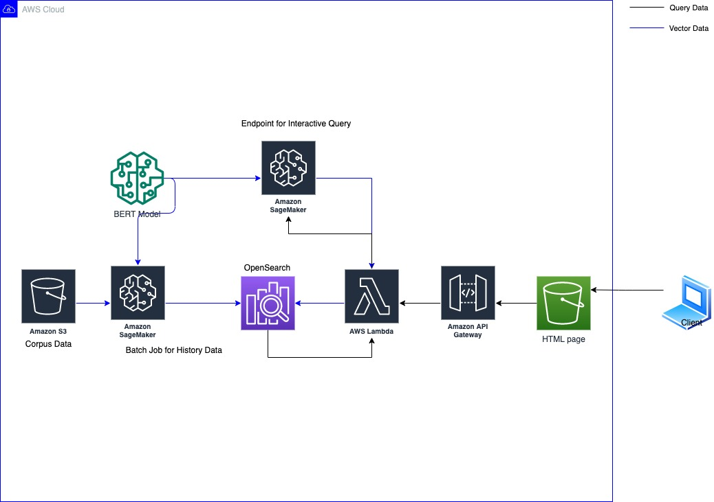
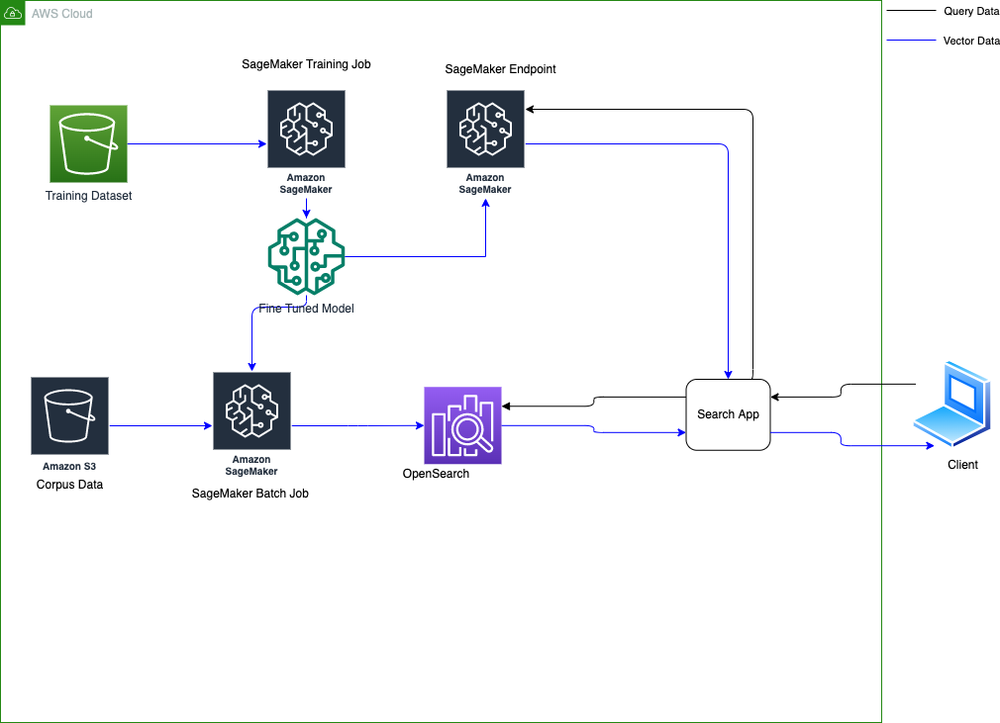

# Semantic Search with Amazon OpenSearch Service

This repository provides a comprehensive tutorial and implementation for building semantic search applications using AWS services. It demonstrates the evolution from traditional keyword search to advanced semantic search using machine learning models.

## Overview

This project guides you through creating an intelligent search system that understands the meaning and context of queries, not just keyword matches. Using pre-trained BERT models and AWS services, you'll build a full-stack semantic search application with real-world Amazon Product Q&A data.



## Key Features

- **Semantic Understanding**: Uses BERT embeddings to understand query intent and context
- **Traditional vs. Modern Search**: Compare BM25 keyword matching with semantic similarity
- **Full-Stack Implementation**: Complete web application with React frontend and AWS backend
- **Real-World Dataset**: Amazon Product Q&A dataset with over 3 million questions
- **AWS Integration**: Leverages OpenSearch, SageMaker, Lambda, and other AWS services
- **Model Fine-Tuning**: Advanced techniques for improving search relevance

## Architecture

The solution uses a modern serverless architecture:

1. **Frontend**: React.js web application for user interaction
2. **API Layer**: AWS Lambda functions for search processing  
3. **Search Engine**: Amazon OpenSearch Service with KNN indexing
4. **ML Models**: BERT models hosted on Amazon SageMaker
5. **Data Storage**: Amazon S3 for datasets and static assets



## How It Works

### Traditional Keyword Search (BM25)
- Matches exact keywords and phrases
- Limited understanding of context or synonyms
- Fast but often misses relevant results

### Semantic Search (BERT + Vector Similarity)
1. **Text Encoding**: Convert queries and documents into 768-dimensional vectors using pre-trained BERT models
2. **Vector Storage**: Store embeddings in Amazon OpenSearch KNN index
3. **Similarity Search**: Find similar content using cosine similarity
4. **Contextual Understanding**: Matches meaning, not just keywords

When you submit a query:
1. The text is converted to embeddings using the SageMaker-hosted BERT model
2. OpenSearch finds the most similar vectors using KNN search
3. Results are ranked by semantic similarity and returned with answers

## Prerequisites

- **AWS Account**: With appropriate permissions for OpenSearch, SageMaker, Lambda, and S3
- **Python Environment**: Python 3.6+ with Jupyter notebook support
- **AWS CLI**: Configured with your credentials
- **Node.js**: Version 14+ for frontend development
- **Basic Knowledge**: Familiarity with machine learning concepts and AWS services

## Module Structure

This tutorial is organized into 6 progressive modules:

### Module 1: BM25 vs. Semantic Similarity
**File**: `Module 1 - Difference between BM25 similarity and Semantic similarity.ipynb`
- Compare traditional keyword search (BM25) with semantic search
- Explore the limitations of keyword matching
- Demonstrate the power of semantic understanding
- Introduction to sentence transformers and vector embeddings

### Module 2: Keyword Search with OpenSearch
**File**: `Module 2 - Keyword Search.ipynb`
- Set up Amazon OpenSearch Service cluster
- Index the Amazon Product Q&A dataset
- Implement traditional text search
- Understand search relevance scoring

### Module 3: Semantic Search Implementation
**File**: `Module 3 - Semantic Search.ipynb`  
- Deploy BERT model to Amazon SageMaker
- Generate vector embeddings for the dataset
- Create KNN index in OpenSearch
- Implement semantic similarity search

### Module 4: Full-Stack Web Application
**File**: `Module 4 - Fullstack Semantic Search.ipynb`
- Build React.js frontend interface
- Deploy Lambda API backend
- Integrate all components
- Create production-ready search application

### Module 5: Model Fine-Tuning
**File**: `Module 5 - Semantic Search with Fine Tuned Model.ipynb`
- Fine-tune BERT models for domain-specific data
- Improve search relevance
- Advanced model optimization techniques
- Performance evaluation

### Module 6: Agent Search with OpenSearch
**File**: `Module 6 - Agent Search with OpenSearch.ipynb`
- Build intelligent AI search agents
- Implement conversational search interfaces
- Combine multiple search strategies intelligently
- Deploy context-aware search experiences
- Integrate with AWS Bedrock for advanced LLM capabilities



## Quick Start

### 1. Infrastructure Setup
Deploy the required AWS infrastructure using CloudFormation:

```bash
# Deploy the initial infrastructure
aws cloudformation create-stack \
  --stack-name semantic-search-infrastructure \
  --template-body file://cfn/initial_template.yaml \
  --capabilities CAPABILITY_IAM
```

### 2. Environment Setup
```bash
# Clone the repository
git clone https://github.com/leejianwei/semantic-search.git
cd semantic-search

# Install Python dependencies
pip install -r requirements.txt

# Install additional ML libraries
pip install sentence-transformers torch transformers
```

### 3. Run the Tutorial
Start with Module 1 and work through each notebook sequentially:

```bash
# Launch Jupyter
jupyter notebook

# Open and run:
# 1. Module 1 - Difference between BM25 similarity and Semantic similarity.ipynb
# 2. Module 2 - Keyword Search.ipynb  
# 3. Module 3 - Semantic Search.ipynb
# 4. Module 4 - Fullstack Semantic Search.ipynb
# 5. Module 5 - Semantic Search with Fine Tuned Model.ipynb
# 6. Module 6 - Agent Search with OpenSearch.ipynb
```

### 4. Frontend Development (Module 4)
```bash
# Navigate to frontend directory
cd frontend

# Install dependencies
npm install

# Start development server
npm start
```

## Dataset

This project uses the **Amazon Product Q&A Dataset** containing over 3 million questions and answers across various product categories. The dataset is available at: https://registry.opendata.aws/amazon-pqa/

## Key Technologies

- **Machine Learning**: BERT, sentence-transformers, PyTorch
- **Search**: Amazon OpenSearch Service with KNN indexing
- **Compute**: Amazon SageMaker for model hosting
- **Backend**: AWS Lambda with Python
- **Frontend**: React.js with Material-UI
- **Infrastructure**: AWS CloudFormation, SAM

## Project Structure

```
semantic-search/
├── Module 1-6 *.ipynb          # Tutorial notebooks
├── backend/                     # Lambda API backend
│   ├── lambda/app.py           # Main Lambda function
│   └── template.yaml           # SAM template
├── frontend/                    # React.js web application
│   ├── src/                    # Source code
│   ├── public/                 # Static assets
│   └── package.json            # Dependencies
├── cfn/                        # CloudFormation templates
├── inference.py                # SageMaker inference script
├── requirements.txt            # Python dependencies
└── README.md                   # This file
```

## Troubleshooting

### Common Issues

**PyTorch Version Issues**
- Ensure PyTorch version 1.10.2 or higher
- Restart kernel after PyTorch upgrades

**OpenSearch Connection Errors** 
- Verify security group settings
- Check AWS credentials and permissions
- Ensure OpenSearch domain is accessible

**SageMaker Endpoint Issues**
- Confirm endpoint is in "InService" status
- Check CloudFormation stack outputs for correct endpoint names
- Verify IAM permissions for SageMaker access

**Frontend Build Issues**
- Use Node.js version 14 or higher
- Clear npm cache: `npm cache clean --force`
- Delete node_modules and reinstall: `rm -rf node_modules && npm install`

### Getting Help

- Check the AWS documentation for service-specific issues
- Review CloudWatch logs for Lambda and SageMaker errors
- Ensure all CloudFormation stacks deployed successfully

## Contributing

1. Fork the repository
2. Create a feature branch
3. Make your changes
4. Add tests if applicable  
5. Submit a pull request

Please read [CONTRIBUTING.md](CONTRIBUTING.md) for details on our code of conduct and development process.

## Cost Considerations

This tutorial uses several AWS services that incur costs:
- Amazon OpenSearch Service (domain hosting)
- Amazon SageMaker (model endpoints)
- AWS Lambda (API requests)
- Amazon S3 (data storage)

Remember to clean up resources after completing the tutorial to avoid ongoing charges.

## License

This library is licensed under the MIT-0 License. See the LICENSE file.
